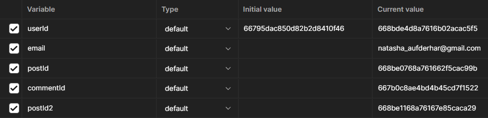
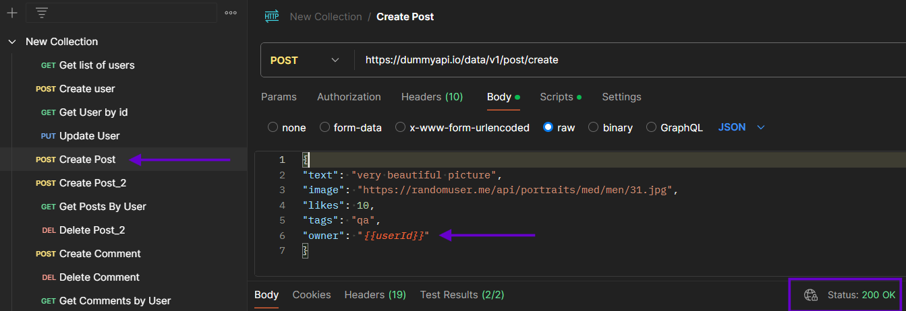

# API_testing_Postman

This project aimed to show skills in testing API and working with Postman as a QA Engineer. 

I used free API documentation available at https://dummyapi.io to test an application simulating the functioning of a social network. It allows users to create profiles, make posts, and leave comments.

### Okay, let's get started. 

First, I created a new collection and set up an environment named "QA."

Then I made a set of requests. You can see a flow here:

You can use variables in Postman to store and access values in different API requests without manual input. 

Let's look at the variables:

And how I’ve created them:

Let’s look at the request “Create Post” where we can see:
- body of the request;
- using the variable {{userId}} instead of manually writing an IP address;
- status code 200.
  

For User creation, we have required firstName, lastName, and email fields. In the future, when running tests, we will have to change the email data manually for each new test iteration. To minimize manual work, I have set a {{$randomEmail}} so that Postman can generate random email values (also I’ve set {{$randomFirstName}} ).

Some tests:
1.	Test checks the status code (here it should be 200 for passing)
2.	Test checks the body (here it should match string)
3.	Test checks the digits in FirstName field 
4.	Test checks the symbols in FirstName field

And response:

Let’s run a collection: 

And I’ve made a test report using Newman:

